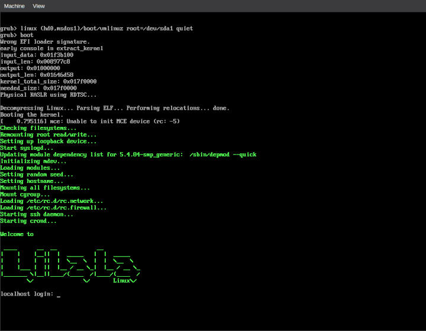

# About


Lilala è una distribuzione linux minimale adatta a creare dei sistemi specializzati in un determinato ambito (domotica, intrattenimento, etc etc etc).

Minimale non è sinonimo di limitante... come in tutte le altre distribuzioni è possibile aggiungere nuove funzionalità fino all'ottenimento del risultato voluto.</br>
Minimale in questo caso significa ridurre e semplificare il numero di componenti necessari affinche un sistema operativo basato su kernel linux sia fruibile.

Infatti il core di Lilala è composto da:

* un sistema di avvio basato su script con pochi automatismi (la configurazione del sistema richiede un intervento manuale di creazione di script ad-hoc)
* busybox
* musl libc

# Build
NOTA: attualmente, nonostante si possa eseguire la build in un ambiente linux generico, è consigliabile utilizzare un installazione completa di Slackware all'interno di una virtual machine, container o chroot.

Riepilogo struttura delle directory
```
|-- assets
|-- cache # cache for downloaded source files
|-- output 
|   -- targets       
|       |-- rpi # output for builded artifacts
|-- platforms
|   |-- rpi # configuration files for target platform
|   |   `-- src
|-- src # source of packages
|   |-- core
|   |   |-- aaa_base
|   |   |-- bash
|   |   |-- busybox
|   |   `-- zlib
|   |-- lib
|   |   |-- SDL2
|-- toolchains # placeholder for toolchains
`-- tools # internal tools useful for build
```

Per poter buildare la distribuzione è necessario un ambiente gcc predisposto per la cross compilazione con la libreria musl. 
Una volta ottenuta (scaricandola o buildandola) è necessario indicarla nel file di configurazione della piattaforma target (attualmente solo raspberry)

